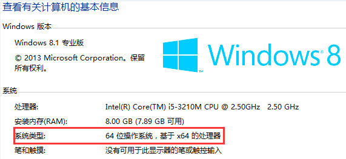

# 指针
虽然这一章的题目是“引用”，但我决定先讲讲指针。在程序中，引用即是对一块内存的引用
## 什么是指针
在计算机科学中，指针（Pointer）是编程语言中的一个对象，利用地址，它的值直接指向（points to）存在电脑存储器中另一个地方的值。
由于通过地址能找到所需的变量单元，可以说，地址指向该变量单元。因此，将地址形象化的称为“指针”。意思是通过它能找到以它为地址的内存单元。
—— via 百度百科

通俗的讲，指针的这个动作像一封邮件，指针就是邮件本身，邮件中所填的地址如同指针所存的地址数值，邮递员根据邮件的地址找到收件人，程序根据指针所存的地址数值找到对应的内存地址。（如果你想
深入了解这些信息，可以翻翻《计算机组成原理》和《操作系统》）

指针在C/C++中都会经常用到，是高级编程语言中为数不多的支持汇编级编码的语法。
## 内存分配
我们在编写程序的时候，肯定会遇到内存分配问题，这是几十年来C/C++程序员必定会头疼的问题。
这一节就来说说内存分配，这有助于深入我们理解指针。

程序的内存空间主要有**栈空间**和**堆空间**，栈是程序在编译时就写好的由系统维护，内存由操作系统管理。
堆是程序在运行期间动态分配，需要程序员在编码阶段手动管理，决定什么时候向系统申请空间，什么时候释放内存空间。

请看这一段代码：

```C++
int num;
double which = 0.0;
int *poniter = new int(0);
```
上面的`num`、`which`、`pointer`所在空间存在于栈上，为什么呢？因为你的代码已经表明了我要用
这三个变量，系统就会在栈上开辟一定等值大小的空间供你使用。也许你会问了，这儿有一个指针
指针难道不是堆上面的吗？嗯，我承认你问的很好，但是`int *pointer`pointer却是在栈上，只不过它存
的值是一个地址数值，这个数值指向堆空间，所以`new int(0)`申请到的内存才是堆空间的。

## 指针初始化
在内存分配一节呢，我们已经似乎提到了指针初始化了，你是否能看出呢？我们还是以代码入手吧。
```C++
int *p = 0;// 0
int *numPtr = new int(445);// 1
float *wavePtr = new float(259.780f);// 2
double *what;// 3
```
聪明的你一定发现了一个指针的必备要素，是的定义一个指针它必须要有一个`*`。对于指针初始化
可以给它赋值一块已存在可用的正确的内存地址如代码注释`1`和`2`，也可以像`0`一样给一个地址
0值，也可以，但是程序不保证地址0上有什么东西出现，也不保证你对指针`p`的操作是正确的——
很显然，对一个地址0的操作是不合法的——想当然的东西八成是错误的！

或许，你够淘气或者够创新，写出了注释`3`的代码，但是很抱歉，虽然你很有创新意识，但这样的
做法我们不赞许，谁也不能保证`what`里面是什么东西——即如果你不再次给`what`指定值，谁也不知道
`what`存了什么样的值——这得看编译器心情了。在VS2015下是这样的。


`0xcccccccc`是什么东西？请看下一节。

## 指针的值 指针地址的值
在“内存分配”一节中，我们提到了指针里面存的是一块堆空间的内存地址的首地址。内存地址是什么？在计算机中，内存地址是由32位无符号整数表示的——但也不一定，
多少位还得取决于操作系统的位数，比如“你的操作系统是32位。操作系统是64位”,如果你的操作系统是64位的而且你的程序是64位模式下编译的，那么指针的大小就会变为
64位。呃……什么，你不知道你的操作系统是多少位的？好吧，从计算机（我的电脑）-> 属性，就可以看到相关信息了。

喜欢命令行的同学，可以在cmd下敲`systeminfo`也可以快速看到哦。

>至于这些不同位数有什么区别，读者有兴趣可以去查阅资料，这里就简单说一下它和
>内存的关系。操作系统的位数越多，那么它在内存上能寻址的范围就越广，比如：32位的的操作系统只能寻址4GB的内存（多于这个数，系统就无法探知了），即$$2^{32}$$，64位的操作系统则
>能寻址$$2^{64}$$ -> $$2^{32}$$ * 4GB = 17179869184GB——这么大！不可思议吧，其实这只是理论寻址的范围，操作系统能不能装下这么大的内存条，还等待技术实现，目前64位的Windows最大
>能支持128G的内存，Windows Server的话，可以达到TB级（1TB = 1024GB）的内存容量。

OK，现在我们来实地操作一下，看看`指针的值`和`指针地址的值`的区别
```c++
#include <iostream>
using namespace std;
int main()
{
	int *pointer = new int(1);
	cout << "x86 pointer:" << pointer << endl;
	cout << "x86 pointer-address:" << &pointer << endl;
	return 0;
}
```
在我的机器上，它是这样输出的：
>x86 pointer:0115A410

>x86 pointer-address:00F6F730

第一行输出了指针`pointer`所在栈空间的地址，第二行输出了`pointer`所指向堆空间的首地址。

可以看出他们是不同的哦，请结合第二节的`内存分配`。
希望你不要搞混了。输出的数据是16进制的，关于进制请参考[编码](./encoding.md)，这里简要说明一下16进制，16进制的1位数字代表了
二进制的4位，所以这里总共是32位。

在上面的代码中，我提到了`x86`,嗯，x86是一种架构，一般指32位的操作系统。那么，你想不想知道在`x64`系统上，这一段代码将会输出什么呢？我的机器是`x64`的
在VS2015中，切换到`x64`编译模式下（其它编译器也可以，但得你自己去搜索切换的方法，VS系列的都是一种切换方法）。
>值得一提的是，如果你的操作系统是`x86`的，那么无法切换到`x64`编译模式下。

好了，现在它输出了这些：
>x86 pointer:000000EEFA8E96E0
>x86 pointer-address:000000EEFA89F748

从输出可以看出，值是64位的。

## 指针的大小
在C++中，可以用sizeof运算符来获取变量的大小，比如：
```C++
int charSize = sizeof(char);
int intSize = sizeof(int);
int ipointerSize = sizeof(int *);
int cpointerSize = sizeof(char *);
```
读者可以尝试编译链接输出这些int变量的值。你会发现虽然`char`类型只占1个字节（1字节即1Byte = 8位即8bit），但是`char *`类型
却是占了4个字节。从这里可以看出，指针的所占空间的大小与类型无关（不管是int的指针，还是char的指针），只与操作系统有关，
操作系统是32位的，指针就是32位的（4字节）；64位的操作系统，指针就是64位的（8字节）。
## *和&
我们知道声明一个指针变量离不开`*`，其实`*`还可以用来取得指针指向那一块内存的值，所以`*`还是一个取值运算。
```C++
int *numPointer = new int(23);
cout << *numPointer << endl;
```
毫无疑问，输出了23。

而`&`是一个取地址运算，可以把取来的地址放入指针变量中。
```c++
int num = 24;
int *numPointer = &num;
cout << *numPointer << endl;
```
>请注意，`&`取地址运算的的对象指针是变量，常量是不允许的，例如：`int *numPointer = &24`。

这里的`&`在C++中还有另一层用法，我们将在本节后面讲其用法。
## 多级指针
我们前面提到的指针，形如：`int *numPointer`只有一个`*`，其实指针也可以有多个`*`来表示不同级别的指针。
### **指针
两个`*`是什么鬼……1个`*`是一级指针，两个就是二级指针咯，3个呢，三级指针咯，4个呢，……

我们来一个简单初始化的实例：
```C++
int aNum = 2;
int *num1Pointer = &aNum;// 取得aNum的地址，存入指针num1Pointer
int **num2Pointer = &num1Pointer;// 取得指针num1Pointer的地址，存入二级指针num2Pointer
cout << *num2Pointer << endl;// 猜猜，这句将会输出什么？
cout << **num2Pointer << endl;// 这句又输出什么呢。
```
请读者去尝试一下，这其实很有趣。

我们还可以这样初始化，直接在取得堆内存的地址后直接赋值给二级指针

```c++
int **num2Pointer = new int*(new int(2));
cout << **num2Pointer;
```
第一个new指定了一级指针的地址（是的，指针的地址也可以是在堆上的，不仅仅在栈上），第二个new指定了二级指针的地址并给其指向的内存初始化为2。
不过这样做并没有什么好处，因为无法直观的知道一级指针的地址。但是在避免反汇编上，有一定用处。
### 多*指针
多`*`，其实就是很多个`*`。

```C++
int aNum = 2;
int *num1Pointer = &aNum;// 取得aNum的地址，存入指针num1Pointer
int **num2Pointer = &num1Pointer;// 取得指针num1Pointer的地址，存入二级指针num2Pointer
int ***num3Pointer = &num2Pointer;
int ****num4Pointer = &num3Pointer;
……
```
可以一直这样进行下去。一般在实际编程中，我们常用的是一级指针和二级指针，三级及以上的指针就很少用了。
## 指针与数组
数组是在指针的基础上建立起来的。
### 什么是数组
数组就是一个有限集合，里面存有同样类型的数据。比如在数学里，我们有实数集合，有理数集合，无理数集合等等。在编程世界里，同理，也有int数组，double数组等，
等接触了对象的概念，你就会知道数组里面的类型可以是对象。
### 如何表示数组
那么在编程世界里，如何表示数组呢。代码为先：
```c++
int intArray[5];// 如此，声明了一个大小为5的int型数组，但是没有初始化它的值，数组存放的值是随机的。特别地，这是一个静态数组。
intArray = new int[3];// compiler error!
int *dynamicArray = new int[9];// 声明了一个大小为9的int型数组，特别地，这是一个动态数组。
dynamicArray = new int[4];// compiler OK!
```
### 静态数组
静态数组就是在编译期间就可以指定数组的大小，并分配了空间，同样的，这分配的空间是在栈上的——系统在编译期间只能操控栈空间。而且静态数组属于const类型，
无法再次更改`intArray`的值，请看上面的代码示例。
### 动态数组
动态数组是在程序运行期间才会分配内存的，并且可以动态改变指针的指向——也就是可以动态改变数组的大小。这在编程上来说，十分灵活。
### 如何区分静态/动态数组
从上面的code可以发现，动态数组就是通过new分配的，在运行期间取得内存；而静态数组是编译期间就决定的，而且不是通过new分配内存的。
### 数组初始化
```c++
int intArray[5] = { 0, 1 };// 将数组的前两个的值初始化为0和1，后面的值不定，看编译器决定。VS2015是默认后面的为0。
int *dynamicArray = new int[9]{ 1,2,3,4,5,6,7,8,9 };
```
初始化的时候，不能超过数组大小，超过就会编译报错。不过，请看下面的代码：
```C++
int *dynamicArray = new int[9];
	for (int i = 0;i < 10;++i) {
		dynamicArray[i] = i;
	}
```
这样的代码，编译不会报错，但运行期的时候，就会令程序崩溃。超出数组界限，即越界。
### 数组索引与取值
C++中的数组，和C是一样的，如果你有C语言的基础，那么此节可以不用看。不过，作点了解还是可以的。

数组通过下标操作`operator[]`操作，来取得数组的对应元素的值，索引是从0开始计算的。代码为先：
```c++
int intArray[5] = { 0, 1, 2,3 ,4 };
cout << intArray[0];
```
>你是否想问，为什么从0开始算下标。这其实是为了方便计算。例如，以上面代码为例，想取值intArray[i]
>底层是这样实现的，intArray[i] = intArray + i \* 4；如果是从1开始，则变成了
>intArray[i] = intArray + (i-1) \* 4。这样就会多了一次计算，对于追求高效率的C/C++来说，是不能容忍的。

### 二维数组初始化
### 指针数组
### 数组指针
## 值传递
## 指针传递
## 指针和结构体
## 指针和函数
### 带有指针参数的函数
#### 函数声明
#### 传值
### 函数指针
### 指针函数
## 指针类型转换
## 指针安全
# 引用
## 什么是引用
## 引用初始化
## 带有引用的参数的函数
### 函数声明
### 传值
## 指针与引用
## 引用安全
## 引用·汇编级讲解
## 指针和引用的使用场景
# Homework
